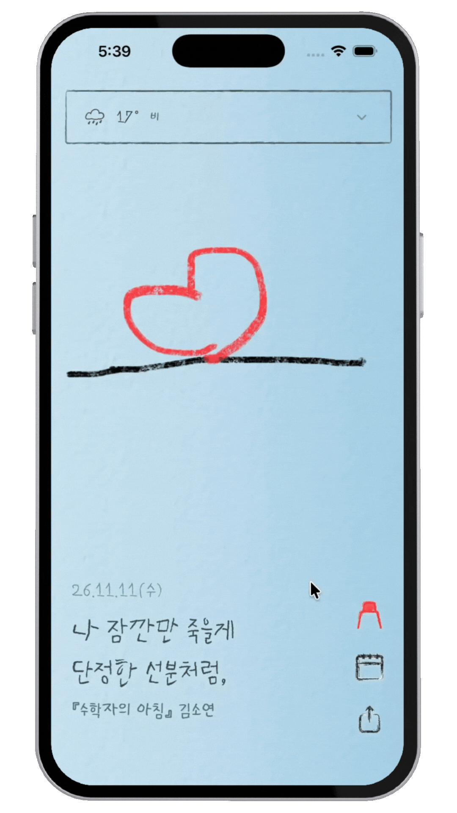
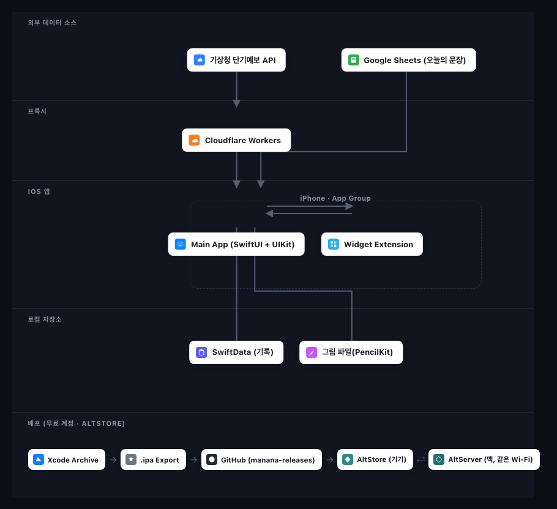

# 📖 Mañana(마냐나) - 오늘의 날씨 속에, 오늘의 책 한 문장을 큐레이션하다


<br/>

📲 **[설치 가이드 바로가기](./docs/INSTALL.md)** — App Store 출시 전, AltStore로 무료 설치하는 방법

<br/>

## ☀️ Mañana - 배경

좋은 문장 하나가 책 한 권에 대한 관심으로 이어지는 경우를 자주 봅니다. 그런데 대부분의 북 큐레이션·홍보 콘텐츠는 광고처럼 소비되고 쉽게 지나쳐집니다.
Mañana는 예비 출판 마케터의 시선에서, **책 문장을 광고가 아니라 오늘의 날씨처럼 자연스럽게 매일 마주치도록 큐레이션**하고 싶다는 생각에서 출발한 iOS 앱입니다.

사용자는 매일 아침 오늘의 날씨 배경 위에 얹힌 책 문장을 만나고, 그 위에 손그림을 더해 하루를 기록합니다. 문장이 홍보처럼 소비되지 않고, 하루의 감정과 함께 자연스럽게 마음에 남도록 설계했습니다. 기록은 달력과 보관함에 쌓이고, 홈 화면·잠금화면 위젯을 통해 앱을 열지 않고도 매일 새로운 문장을 마주치게 됩니다.

<br/>

## ☀️ Mañana - 개요

*- 광고가 아니라 날씨처럼, 매일 한 문장의 책을 큐레이션하다 -*

Mañana는 스페인어로 '내일' 또는 '아침'을 뜻합니다. 오늘 마주친 문장 하나가, 내일 그 책을 펼쳐보고 싶어지는 작은 씨앗이 되길 바라는 마음을 담았습니다.

- 매일 자정, 엄선된 책 문장이 오늘의 날씨 배경 위에 손글씨 타이핑 애니메이션으로 자연스럽게 드러납니다 — 배너 광고가 아니라 날씨 정보처럼 매일 마주치는 문장입니다.
- 문장 큐레이션은 Google Sheets로 관리되어, 소개하고 싶은 책과 문장을 언제든 기획·교체할 수 있습니다.
- 사용자는 그 문장 위에 PencilKit으로 직접 그림을 더해, 문장에 대한 자신만의 감상을 하루의 기록으로 남깁니다.
- 기록은 이미지로 캡처해 공유할 수 있어, 큐레이션된 문장이 자연스럽게 입소문으로 퍼져나갈 여지를 남깁니다.
- 홈 화면·잠금화면 위젯을 통해 앱을 열지 않아도 오늘의 문장을 매일 마주치게 됩니다.

<br/>

## ☀️ 담당 역할

기획부터 UI/UX 디자인, 손그림 아트워크 제작, iOS 개발(Claude Code와의 페어 프로그래밍)까지 전 과정에 참여. 개발자와의 협업을 통해 기능을 구현하고, 실기기 테스트와 피드백을 반복하며 완성도를 높임.

<br/>

## ☀️ 주요 기능
---
### ☁️ 홈 화면 · 잠금화면 위젯
- 작은 위젯은 오늘의 문장만, 큰 위젯은 날씨+문장+그림을 함께 보여줍니다.
- 앱이 2주치 문장을 미리 App Group에 저장해두고, 위젯이 매 자정(KST)마다 스스로 타임라인 엔트리를 생성해 앱을 열지 않아도 자정에 맞춰 문장이 자동으로 갱신됩니다.
- 잠금화면 위젯 2종(오늘의 문장 전용)을 함께 제공합니다.

<p align="center">
  
  
  
</p>

### ☁️ 오늘의 날씨 + 문장
- 기상청(KMA) 단기예보 API를 Cloudflare Worker 프록시를 거쳐 받아온 날씨 정보를 바탕으로, 손그림 날씨 아트워크(맑음/흐림/비/눈 등)를 배경으로 보여줍니다.

<p align="center">
  
</p>

- 매일 Google Sheets에 정리된 문장 중 오늘의 문장이 배경 위에 함께 표시됩니다.
- 큰 날씨 박스와 작은 날씨 박스를 접었다 펼 수 있습니다.

<p align="center">
  
  
  
  
</p>

### ☁️ 손그림 다이어리
- PencilKit 기반 캔버스에서 펜/지우개/색상 팔레트로 자유롭게 그림을 그립니다.
- 펜을 선택한 색상에 따라 펜촉만 색이 바뀌고 몸통은 검정으로 유지되는 손그림 스타일 아이콘을 사용합니다.
- 다크 모드에서 검정/흰색 잉크가 반전되는 PencilKit 특성을 라이트 모드 강제 렌더링으로 해결해, 그림 색이 항상 그린 그대로 저장·공유됩니다.

<p align="center">
  
  
  
</p>

### ☁️ 달력 · 보관함
- 그림을 그린 날짜는 달력에 표시되고, 보관함에서 날짜별 그림과 문장을 모아볼 수 있습니다.

<p align="center">
  
</p>
  
- 라이트/다크 모드 모두 적응형 텍스트 색상(`.primary`)으로 대응합니다.

<p align="center">
  
  
  
  
</p>

### ☁️ 공유하기 및 내일 문장
- 실제 화면을 그대로 캡처해 이미지로 공유할 수 있습니다.
- 내일 다가올 문장은 마냐나의 의미 설명 문구가 뜹니다.

<p align="center">
  
  
</p>

<br/>

## ☀️ 기술 스택
---

**☁️ iOS App**


**☁️ 외부 연동**


**☁️ 저장소**


**☁️ 개발 · 배포**


**☁️ 에셋 제작 도구**

-3776AB?style=for-the-badge&logo=python&logoColor=yellow)


### ☁️ 주요 기술

**iOS App**
- Xcode / XcodeGen (project.yml 기반 프로젝트 관리)
- SwiftUI (iOS 17+)
- UIKit (캔버스 커스터마이징, 라이트모드 강제 이미지 렌더링)
- SwiftData (로컬 데이터 저장)
- PencilKit (손그림 캔버스)
- Core Location (위치 기반 날씨)
- WidgetKit (홈 화면 / 잠금화면 위젯)

**Widget Extension**
- WidgetKit
- App Group (`UserDefaults(suiteName:)`, 공유 파일 컨테이너)로 앱 ↔ 위젯 데이터 공유 — 사이드로드 대응을 위해 App Group ID를 런타임에 동적 해석
- TimelineProvider — 앱이 미리 저장한 2주치 문장으로 매 자정 엔트리를 생성해 앱 실행 없이 자동 갱신

**외부 연동**
- 기상청(KMA) 공공데이터 — 날씨 정보
- Cloudflare Workers — 날씨 API 프록시 (서버 측 키 보관)
- Google Sheets (CSV export) — 오늘의 문장 데이터 관리

**배포 / 서명**
- xcrun devicectl (실기기 빌드/설치/실행)
- Local.xcconfig 분리 (개인 서명 정보를 공유 저장소에서 제외)
- Privacy Manifest / Export Compliance 대응 (App Store 심사 준비)
- AltStore / AltServer — 유료 Developer Program 없이 무료 계정으로 지속 배포
- `xcodebuild archive` + `exportArchive` — `.ipa` 파일 생성
- 별도 공개 저장소(`manana-releases`)의 `apps.json` — AltStore 소스 매니페스트로 앱 배포/업데이트 관리

**에셋 제작 도구**
- Python (PIL/Pillow) — 아이콘 크롭, 레이어 분리, 채우기 마스크 생성
- CoreText — 폰트 메트릭 측정

## ☀️ 프로젝트 파일 구조(서비스 아키텍처)
---

<p align="center">
  
</p>

<br/>

```
Manana
  ├── App
  │   └── MananaApp.swift
  ├── Models
  │   ├── DailyQuote.swift
  │   ├── DiaryEntry.swift
  │   ├── Quote.swift
  │   ├── WeatherBackground.swift
  │   └── WeatherCondition.swift
  ├── Services
  │   ├── DrawingStorage.swift
  │   ├── KMAGrid.swift
  │   ├── LocationManager.swift
  │   ├── QuoteService.swift
  │   └── WeatherService.swift
  ├── Shared
  │   ├── ActivityView.swift
  │   ├── AppGroup.swift          (런타임 App Group ID 해석 — 사이드로드 대응)
  │   ├── Font+Manana.swift
  │   ├── SharedDrawingStore.swift
  │   └── SharedWeatherStore.swift
  ├── Views
  │   ├── ArchiveListView.swift
  │   ├── DiaryCalendarView.swift
  │   ├── DiaryEntryDetailView.swift
  │   ├── DrawingCanvasView.swift
  │   └── MainView.swift
  ├── Resources
  │   ├── Backgrounds
  │   └── Fonts
  └── Assets.xcassets
      ├── AppIcon
      ├── BigBox / MiniBox (날씨 박스 아트워크)
      ├── CalendarBackground
      ├── IconCalendar / IconShare / IconCrayon 등 (손그림 버튼 아이콘)
      └── weathericon_* (날씨별 아이콘 15종)

MananaWidget
  ├── CombinedWidget.swift        (홈 화면 큰 위젯 — 날씨+문장+그림)
  ├── DrawingWidget.swift          (홈 화면 작은 위젯 — 그림)
  ├── WeatherQuoteWidget.swift     (홈 화면 작은 위젯 — 문장)
  ├── QuoteLockScreenWidget.swift  (잠금화면 위젯)
  ├── QuoteLockScreenWideWidget.swift
  ├── WeatherEntryProvider.swift   (타임라인 프로바이더)
  ├── MananaWidgetBundle.swift
  ├── PrivacyInfo.xcprivacy
  └── Backgrounds

worker                              (Cloudflare Worker — 날씨 API 프록시)
  └── src

build                              (배포용 산출물 — gitignore)
  ├── Manana.xcarchive
  ├── exportOptions.plist
  └── export
      └── Manana.ipa

manana-releases                    (AltStore 배포 전용 공개 저장소 — 소스코드 없음)
  ├── apps.json                    (AltStore 소스 매니페스트)
  ├── Manana.ipa
  └── AppIcon.png
```

<br/>

## ☀️ 협업 환경 및 트러블슈팅
---

### ☁️ 협업 방식
- **개발 방식**: 기획/디자인을 맡은 사용자가 요구사항을 자연어로 전달하면, Claude Code가 코드를 구현하고 시뮬레이터·실기기에서 즉시 빌드해 결과를 확인시켜주는 방식으로 반복 개발

- **기능 단위 커밋**: 아이콘 교체, 위젯 개선, 버그 수정 등 기능 단위로 커밋 메시지를 작성하고 즉시 GitHub에 반영

- **실기기 우선 검증**: 시뮬레이터로 먼저 확인 후, 실제 아이폰에 설치해 최종 확인하는 2단계 검증 절차

- **외부 협업자 연동**: 친구가 별도로 기여한 기능(펜 아이콘 → 크레용 아이콘 교체, 위젯 자정 갱신 로직 등)을 GitHub을 통해 pull 받아 통합

- **무료 배포 파이프라인**: 유료 Apple Developer Program 없이도 실기기 사용을 지속할 수 있도록 AltStore 기반 배포 구조를 직접 설계 — 소스코드 저장소는 비공개, 배포 산출물만 별도 공개 저장소(`manana-releases`)에 분리

### ☁️ 트러블슈팅
- **사이드로드 위젯 placeholder 버그**: AltStore 재서명 시 App Group 식별자에 팀 ID가 붙어 앱과 위젯이 서로 다른 저장 공간을 바라보던 문제를, 런타임에 프로비저닝 프로필에서 실제 App Group을 읽어오는 방식으로 해결

- **자정 문장 미갱신 버그**: "내일 문장 1개"만 미리 저장하던 구조를, 앱이 2주치 문장을 미리 저장하고 위젯이 매 자정 엔트리를 스스로 생성하는 구조로 바꿔 앱 실행 없이도 정확히 갱신되도록 수정

- **다크 모드 잉크 반전 버그**: PencilKit의 적응형 검정/흰색 잉크가 렌더링 시점의 시스템 모드에 따라 반전되던 문제를, 저장·렌더링 시점을 항상 라이트 모드로 고정해 해결

- **위젯 정보 밀도 최적화**: 날씨 정보 위주였던 위젯을 반복 검증을 거쳐 작은 위젯은 문장 중심으로 단순화하고, 큰 위젯은 날씨 정보의 크기·색상을 키워 가독성을 확보

- **손그림 아이콘 인터랙션**: 여백 크롭으로 아이콘 체감 크기를 개선하고, 펜촉/채우기/몸통 레이어를 분리해 "선택한 색으로 펜촉만 바뀌는" 인터랙션을 구현

- **App Store 심사 준비**: Privacy Manifest·Export Compliance 등 심사 기준을 사전 점검하고 개인정보처리방침을 작성해 반려 리스크를 최소화

<br/>

<a id="install-guide"></a>
## ☀️ 설치 방법 (AltStore, 무료 배포)
---
앱스토어에 정식 출시되기 전까지, **AltStore**를 이용해서 마냐나 앱을 설치하고 계속 사용하는 방법입니다.
컴퓨터(맥 또는 윈도우) 한 대가 필요합니다.

### 1단계. 아이폰에서 개발자 모드 켜기

1. **설정** → **개인정보 보호 및 보안** → 맨 아래 **개발자 모드**
2. 켜기로 전환
3. 아이폰이 재시작됨
4. 재시작 후 뜨는 팝업에서 **"켜기"** 선택 (Apple ID 암호 입력 필요할 수 있음)

> 이 단계를 안 하면 이후 앱이 설치돼도 실행이 되지 않습니다.

### 2단계. 컴퓨터에 AltServer 설치

1. [altstore.io](https://altstore.io) 접속
2. 본인 컴퓨터에 맞는 버전 다운로드 (macOS / Windows)
3. 설치 후 실행 — macOS는 메뉴바에, Windows는 시스템 트레이에 아이콘이 생김
4. **중요**: 다운로드한 앱은 바로 실행하지 말고, macOS 기준 **Applications 폴더로 옮긴 뒤** 실행하기 (안 그러면 아이콘이 반응 안 하는 문제가 생길 수 있음)

### 3단계. 아이폰에 AltStore 앱 설치

1. 아이폰을 케이블로 컴퓨터에 연결 → "신뢰" 선택
2. AltServer 아이콘 클릭 → **"Install AltStore"** → 본인 아이폰 선택
3. **본인 Apple ID**(이메일)와 비밀번호 입력
   - 앱 전용 비밀번호(App-Specific Password)를 요구할 수도 있음 → [appleid.apple.com](https://appleid.apple.com)에서 로그인 후 생성 가능
4. 설치 완료되면 아이폰 홈 화면에 AltStore 앱이 생김

### 4단계. 개발자 프로필 신뢰하기

1. 아이폰 **설정** → **일반** → **VPN 및 기기 관리**
2. "개발자 앱" 항목에서 본인 Apple ID 탭
3. **"[Apple ID] 신뢰"** 선택

### 5단계. 마나나 소스 등록하기

1. 아이폰의 **AltStore 앱** 열기
2. 하단 **"Sources"** 탭
3. 왼쪽 위 **"+"** 버튼
4. 아래 주소 붙여넣기:
   ```
   https://raw.githubusercontent.com/mananamanana/manana-releases/main/apps.json
   ```
5. 추가 완료

### 6단계. 마나나 설치하기

1. 하단 **"Browse"** 탭 이동
2. **"마냐나"** 찾기 (또는 검색창에 "마냐나" 입력)
3. **"INSTALL"** 버튼 탭
4. 설치 중 **"Keep App Extensions"**(앱 확장 기능 유지) 관련 팝업이 뜨면 **"Keep"** 선택 — 이걸 눌러야 위젯(홈 화면/잠금화면)도 같이 설치됨
5. 설치 완료되면 홈 화면에 마냐나 아이콘 생성

### 이후 업데이트하는 방법

1. AltStore 앱 → **"My Apps"** 탭
2. 새 버전이 있으면 맨 위 배너가 "Update Available"로 바뀌고, 마냐나 항목에 **"UPDATE"** 버튼이 나타남
3. 그 버튼만 누르면 새 버전 설치 (기존 그림·기록은 유지됨)

> 자동으로 알림이 오지는 않아서, 가끔 AltStore 앱을 직접 열어서 확인해야 합니다.

### 인증서 갱신 관련 (중요)

무료 Apple ID로 서명한 앱은 **7일마다 인증서가 만료**됩니다. 계속 쓰려면:

- 인증서 만료 전에 **본인 컴퓨터를 켜두고, AltServer를 실행한 상태**로 아이폰을 **같은 와이파이**에 연결해두면 자동으로 갱신됨
- 또는 AltStore 앱 → My Apps → **"Refresh All"** 눌러서 수동 갱신 (이때도 컴퓨터+같은 와이파이 조건은 동일하게 필요함)
- 7일이 지나도록 한 번도 갱신을 못 하면 앱이 실행되지 않게 되고, 다시 설치해야 함

<br/>

## ☀️ 팀원 소개
---
- 이찬영
- 추원지
- 이성재
