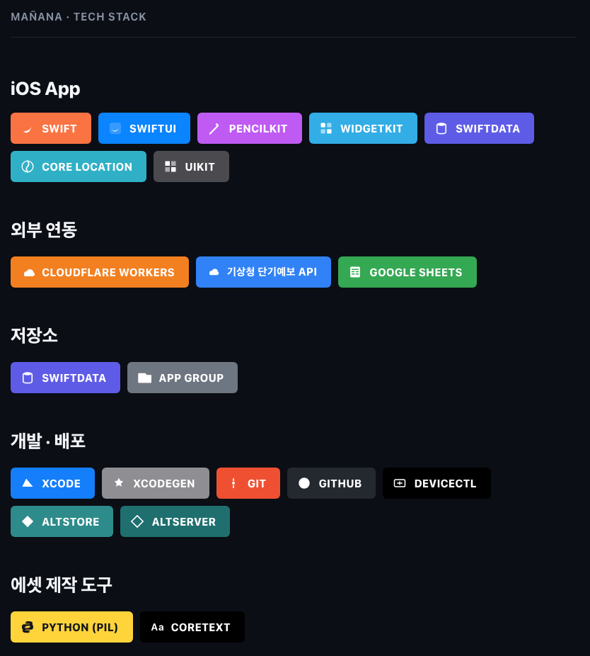

# 🌤️ Mañana(마냐나)

<p align="center">
  
</p>

<br/>

## ✔ 서비스 아키텍처
---
<p align="center">
  
</p>

<br/>

## ✔ 기술 스택 한눈에 보기
---
<p align="center">
  
</p>

<br/>

## 📄 마냐나_포트폴리오_요약.md
---

# 마냐나(Mañana) — 포트폴리오용 프로젝트 요약

## 한 줄 소개
날씨, 오늘의 책 문장, 손그림 다이어리를 결합한 iOS 앱. "mañana"는 스페인어로 "내일" 또는 "아침"을 뜻하며, 매일 아침 새로운 문장과 함께 하루를 기록하는 감성 다이어리 앱입니다.

## 핵심 기능
- 실시간 날씨(기상청 공공데이터 기반)에 맞춰 배경 아트워크와 분위기가 바뀜
- 매일 자정 새로운 책 문장이 갱신되고, 손글씨 타이핑 애니메이션으로 표시됨
- PencilKit 기반 손그림 캔버스로 하루의 감정/기록을 그림으로 남길 수 있음
- 지난 기록을 날짜별로 다시 볼 수 있는 보관함(캘린더/리스트 뷰)
- 홈 화면·잠금화면 위젯으로 오늘의 문장과 그림을 바로 확인 가능
- 오늘의 기록(그림+문장+날씨)을 이미지로 공유 가능

## 담당 역할
기획부터 UI/UX 디자인, 손그림 아트워크 제작, iOS 개발(Claude Code와의 페어 프로그래밍)까지 전 과정에 참여. 개발자와의 협업을 통해 기능을 구현하고, 실기기 테스트와 피드백을 반복하며 완성도를 높임.

## 기술 스택
- **SwiftUI · UIKit** (iOS 17+) — 전체 UI, 그리고 캔버스·이미지 렌더링 세부 제어
- **WidgetKit** — 홈 화면/잠금화면 위젯 (App Group을 통한 앱-위젯 데이터 공유)
- **PencilKit** — 손그림 다이어리 캔버스
- **SwiftData** — 로컬 기록 저장
- **XcodeGen** — 프로젝트 파일 관리
- Cloudflare Worker (날씨 API 프록시), Google Sheets (문장 데이터 관리)
- **AltStore** — 무료 계정 기반 배포

## 개발 과정에서 해결한 문제들

**1. 다크모드에서 손그림이 반전되어 보이는 버그**
검정색으로 그린 그림이 위젯이나 공유 이미지에서 흰색으로 나타나는 현상을 발견. PencilKit의 "적응형 잉크" 특성(다크모드에서 자동으로 색이 반전되는 접근성 기능)이 원인임을 파악하고, 이미지 렌더링 시점에 항상 라이트 모드 기준으로 고정하도록 수정.

**2. 위젯 정보 밀도 최적화**
처음엔 위젯에 날씨 아이콘·온도·습도 등 많은 정보를 넣었지만, 실제 사용해보니 배경 위에서 잘 안 보이고 정작 중요한 "오늘의 문장"이 묻히는 문제 발견. 사용자 테스트를 거쳐 작은 위젯은 문장만 남기고, 큰 위젯은 날씨 정보의 색상·크기를 대폭 키워 가독성을 확보.

**3. 손그림 아이콘의 디테일한 인터랙션 구현**
버튼 아이콘을 직접 그린 손그림으로 교체하는 과정에서, 원본 이미지의 여백 문제(체감 크기가 작아 보임)를 이미지 크롭으로 해결. 이후 "펜을 선택한 색상에 맞춰 펜촉만 색이 바뀌는" 인터랙션을 구현하기 위해 아이콘을 여러 레이어(펜촉 윤곽/채우기/몸통)로 분리하는 이미지 처리 작업을 진행.

**4. 앱스토어 출시 준비**
Apple 심사 기준(2024년부터 필수인 Privacy Manifest, Export Compliance 등)을 사전에 점검하고, 개인정보처리방침 문서를 작성. 위치 정보 수집 목적과 범위를 명확히 하여 심사 반려 리스크를 최소화.

**5. 예산 제약 안에서의 배포 파이프라인 구축**
유료 Apple Developer Program 없이 실기기에서 앱을 계속 사용할 방법이 필요했음. 무료 인증서의 7일 만료 구조를 이해하고, AltStore/AltServer 기반 자동 재서명 체계로 전환. `.ipa` 파일과 업데이트 정보를 담은 배포 전용 저장소를 별도로 만들어, 소스코드는 비공개로 유지하면서도 앱만 배포 가능한 구조를 설계. 이 과정에서 겪은 프로필 신뢰 문제, 데이터 유실 사고를 통해 iOS 코드서명 구조와 로컬 저장 방식의 리스크를 실제로 체감하고 대응함.

**6. 사이드로드 환경에서 위젯이 깨지는 문제 진단·해결**
AltStore 배포 후 위젯이 데이터를 전혀 못 읽고 빈 화면만 뜨는 문제 발생. 원인은 AltStore가 재서명하며 App Group 식별자에 팀 ID를 덧붙여, 하드코딩된 식별자와 실제 부여된 식별자가 어긋난 것. 앱과 위젯이 같은 공유 컨테이너를 바라보도록, **런타임에 프로비저닝 프로필을 파싱해 실제 부여된 App Group을 읽어오는 방식**으로 해결(정상 서명·시뮬레이터에선 기본값으로 폴백). 더불어 "자정마다 문장이 바뀐다"는 핵심 경험이 위젯에서만 동작하지 않던 문제도, 앱이 2주치 문장을 미리 공유해두고 위젯이 매 자정 시점의 엔트리를 스스로 생성하도록 타임라인 구조를 재설계해 앱 실행 없이도 갱신되게 만듦.

## 배운 점
- 사용자 입장에서 반복적으로 스크린샷을 확인하며 "실제로 눈에 잘 보이는가"를 기준으로 디자인을 계속 다듬는 과정의 중요성
- 기술적 제약(CSV 내보내기는 서식 정보를 담지 못함, PencilKit의 적응형 색상 등)을 이해하고 그 안에서 최선의 해결책을 찾는 경험
- 개발자가 아니어도 명확한 요구사항과 피드백으로 실제 동작하는 앱을 함께 만들어갈 수 있다는 것
- 로컬 전용 저장 구조(iCloud 미동기화)의 데이터 유실 위험을 실제로 겪으며, 배포·백업 전략도 기획 단계부터 고려해야 한다는 것을 체감

## 포트폴리오 자료
- `마냐나_기술스택.png` — 기술 스택 배지 이미지
- `마냐나_서비스아키텍처.png` — 서비스 아키텍처 다이어그램
- `마냐나_아이콘모음.png` — 기술 스택 아이콘 모음

<br/>

## 📄 마냐나_프로젝트_구조.md
---

✔ 주요 기술

**iOS App**

* Xcode / XcodeGen (project.yml 기반 프로젝트 관리)
* SwiftUI (iOS 17+)
* UIKit (캔버스 커스터마이징, 라이트모드 강제 이미지 렌더링)
* SwiftData (로컬 데이터 저장)
* PencilKit (손그림 캔버스)
* Core Location (위치 기반 날씨)
* WidgetKit (홈 화면 / 잠금화면 위젯)

**Widget Extension**

* WidgetKit
* App Group (`UserDefaults(suiteName:)`, 공유 파일 컨테이너)로 앱 ↔ 위젯 데이터 공유 — 사이드로드 대응을 위해 App Group ID를 런타임에 동적 해석
* TimelineProvider — 앱이 미리 저장한 2주치 문장으로 매 자정 엔트리를 생성해 앱 실행 없이 자동 갱신

**외부 연동**

* 기상청(KMA) 공공데이터 — 날씨 정보
* Cloudflare Worker — 날씨 API 프록시(서버 측 키 보관)
* Google Sheets (CSV export) — 오늘의 문장 데이터 관리

**배포 / 서명**

* xcrun devicectl (실기기 빌드/설치/실행)
* Local.xcconfig 분리(개인 서명 정보를 공유 저장소에서 제외)
* Privacy Manifest / Export Compliance 대응 (App Store 심사 준비)
* AltStore / AltServer — 유료 Developer Program 없이 무료 계정으로 지속 배포
* `xcodebuild archive` + `exportArchive` — `.ipa` 파일 생성
* 별도 공개 저장소(`manana-releases`)의 `apps.json` — AltStore 소스 매니페스트로 앱 배포/업데이트 관리

**협업 도구(이미지 처리)**

* Python (PIL/Pillow) — 아이콘 크롭, 레이어 분리, 채우기 마스크 생성
* CoreText — 폰트 메트릭 측정

---

✔ 프로젝트 파일 구조

```
Manana
  ├── App
  │   └── MananaApp.swift
  ├── Models
  │   ├── DailyQuote.swift
  │   ├── DiaryEntry.swift
  │   ├── Quote.swift
  │   ├── WeatherBackground.swift
  │   └── WeatherCondition.swift
  ├── Services
  │   ├── DrawingStorage.swift
  │   ├── KMAGrid.swift
  │   ├── LocationManager.swift
  │   ├── QuoteService.swift
  │   └── WeatherService.swift
  ├── Shared
  │   ├── ActivityView.swift
  │   ├── AppGroup.swift          (런타임 App Group ID 해석 — 사이드로드 대응)
  │   ├── Font+Manana.swift
  │   ├── SharedDrawingStore.swift
  │   └── SharedWeatherStore.swift
  ├── Views
  │   ├── ArchiveListView.swift
  │   ├── DiaryCalendarView.swift
  │   ├── DiaryEntryDetailView.swift
  │   ├── DrawingCanvasView.swift
  │   └── MainView.swift
  ├── Resources
  │   ├── Backgrounds
  │   └── Fonts
  └── Assets.xcassets
      ├── AppIcon
      ├── BigBox / MiniBox (날씨 박스 아트워크)
      ├── CalendarBackground
      ├── IconCalendar / IconShare / IconCrayon 등 (손그림 버튼 아이콘)
      └── weathericon_* (날씨별 아이콘 15종)

MananaWidget
  ├── CombinedWidget.swift        (홈 화면 큰 위젯 — 날씨+문장+그림)
  ├── DrawingWidget.swift          (홈 화면 작은 위젯 — 그림)
  ├── WeatherQuoteWidget.swift     (홈 화면 작은 위젯 — 문장)
  ├── QuoteLockScreenWidget.swift  (잠금화면 위젯)
  ├── QuoteLockScreenWideWidget.swift
  ├── WeatherEntryProvider.swift   (타임라인 프로바이더)
  ├── MananaWidgetBundle.swift
  ├── PrivacyInfo.xcprivacy
  └── Backgrounds

build                              (배포용 산출물 — gitignore)
  ├── Manana.xcarchive
  ├── exportOptions.plist
  └── export
      └── Manana.ipa

manana-releases                    (AltStore 배포 전용 공개 저장소 — 소스코드 없음)
  ├── apps.json                    (AltStore 소스 매니페스트)
  ├── Manana.ipa
  └── AppIcon.png
```

---

✔ 협업 툴

* Git / GitHub — 버전 관리, 커밋 단위 기능 관리
* Claude Code — AI 페어 프로그래밍 (기획자가 요구사항을 전달하면 실시간으로 구현·빌드·실기기 테스트까지 진행)

✔ 협업 환경

* **개발 방식**: 기획/디자인을 맡은 사용자가 요구사항을 자연어로 전달하면, Claude Code가 코드를 구현하고 시뮬레이터·실기기에서 즉시 빌드해 결과를 스크린샷으로 확인시켜주는 방식으로 반복 개발
* **기능 단위 커밋**: 아이콘 교체, 위젯 개선, 버그 수정 등 기능 단위로 커밋 메시지를 작성하고 즉시 GitHub에 반영
* **실기기 우선 검증**: 시뮬레이터로 먼저 확인 후, 실제 아이폰에 설치해 최종 확인하는 2단계 검증 절차
* **외부 협업자 연동**: 친구가 별도로 기여한 기능(펜 아이콘 → 크레용 교체, 위젯 자정 갱신 로직 등)을 GitHub을 통해 pull 받아 통합
* **무료 배포 파이프라인**: 유료 계정 없이도 실기기 사용을 지속할 수 있도록 AltStore 기반 배포 구조를 직접 설계 — 소스코드 저장소는 비공개, 배포 산출물만 별도 공개 저장소에 분리

<br/>

## 📄 마나나 설치가이드.md
---

# 마나나(Mañana) 앱 설치 가이드

앱스토어에 정식 출시되기 전까지, **AltStore**를 이용해서 마냐나 앱을 설치하고 계속 사용하는 방법입니다.
컴퓨터(맥 또는 윈도우) 한 대가 필요합니다.

---

## 1단계. 아이폰에서 개발자 모드 켜기

1. **설정** → **개인정보 보호 및 보안** → 맨 아래 **개발자 모드**
2. 켜기로 전환
3. 아이폰이 재시작됨
4. 재시작 후 뜨는 팝업에서 **"켜기"** 선택 (Apple ID 암호 입력 필요할 수 있음)

> 이 단계를 안 하면 이후 앱이 설치돼도 실행이 되지 않습니다.

---

## 2단계. 컴퓨터에 AltServer 설치

1. [altstore.io](https://altstore.io) 접속
2. 본인 컴퓨터에 맞는 버전 다운로드 (macOS / Windows)
3. 설치 후 실행 — macOS는 메뉴바에, Windows는 시스템 트레이에 아이콘이 생김
4. **중요**: 다운로드한 앱은 바로 실행하지 말고, macOS 기준 **Applications 폴더로 옮긴 뒤** 실행하기 (안 그러면 아이콘이 반응 안 하는 문제가 생길 수 있음)

---

## 3단계. 아이폰에 AltStore 앱 설치

1. 아이폰을 케이블로 컴퓨터에 연결 → "신뢰" 선택
2. AltServer 아이콘 클릭 → **"Install AltStore"** → 본인 아이폰 선택
3. **본인 Apple ID**(이메일)와 비밀번호 입력
   - 앱 전용 비밀번호(App-Specific Password)를 요구할 수도 있음 → [appleid.apple.com](https://appleid.apple.com)에서 로그인 후 생성 가능
4. 설치 완료되면 아이폰 홈 화면에 AltStore 앱이 생김

---

## 4단계. 개발자 프로필 신뢰하기

1. 아이폰 **설정** → **일반** → **VPN 및 기기 관리**
2. "개발자 앱" 항목에서 본인 Apple ID 탭
3. **"[Apple ID] 신뢰"** 선택

---

## 5단계. 마나나 소스 등록하기

1. 아이폰의 **AltStore 앱** 열기
2. 하단 **"Sources"** 탭
3. 왼쪽 위 **"+"** 버튼
4. 아래 주소 붙여넣기:
   ```
   https://raw.githubusercontent.com/mananamanana/manana-releases/main/apps.json
   ```
5. 추가 완료

---

## 6단계. 마나나 설치하기

1. 하단 **"Browse"** 탭 이동
2. **"마냐나"** 찾기 (또는 검색창에 "마냐나" 입력)
3. **"INSTALL"** 버튼 탭
4. 설치 중 **"Keep App Extensions"**(앱 확장 기능 유지) 관련 팝업이 뜨면 **"Keep"** 선택 — 이걸 눌러야 위젯(홈 화면/잠금화면)도 같이 설치됨
5. 설치 완료되면 홈 화면에 마냐나 아이콘 생성

---

## 이후 업데이트하는 방법

1. AltStore 앱 → **"My Apps"** 탭
2. 새 버전이 있으면 맨 위 배너가 "Update Available"로 바뀌고, 마냐나 항목에 **"UPDATE"** 버튼이 나타남
3. 그 버튼만 누르면 새 버전 설치 (기존 그림·기록은 유지됨)

> 자동으로 알림이 오지는 않아서, 가끔 AltStore 앱을 직접 열어서 확인해야 합니다.

---

## 인증서 갱신 관련 (중요)

무료 Apple ID로 서명한 앱은 **7일마다 인증서가 만료**됩니다. 계속 쓰려면:

- 인증서 만료 전에 **본인 컴퓨터를 켜두고, AltServer를 실행한 상태**로 아이폰을 **같은 와이파이**에 연결해두면 자동으로 갱신됨
- 또는 AltStore 앱 → My Apps → **"Refresh All"** 눌러서 수동 갱신 (이때도 컴퓨터+같은 와이파이 조건은 동일하게 필요함)
- 7일이 지나도록 한 번도 갱신을 못 하면 앱이 실행되지 않게 되고, 다시 설치해야 함

<br/>

## 📄 마냐나_대화기록_정리.md
---

# 마냐나(Mañana) 앱 개발 — Claude Code 세션 정리

이 문서는 Claude Code와 함께 마냐나 앱을 만들면서 진행했던 작업들을 시간 순서대로 정리한 기록입니다.

## 앱 소개

마냐나는 날씨, 오늘의 도서 문장, 손그림 다이어리를 결합한 한국어 iOS 앱입니다. 매일 하나의 날씨 배경과 문장이 뜨고, 사용자는 그 위에 손으로 그림을 그려 하루를 기록합니다.

## 1. 초기 기능 개발 (이전 세션들)

- 손그림 날씨 박스 아트워크(미니/큰 박스), 달력/보관함 배경 이미지 제작
- 다크 모드 대응: 보관함/달력 텍스트를 고정 색상 대신 `.primary`(적응형)로 전환
- 보관함 상세 화면을 메인 화면과 톤 통일 (그라디언트 카드 대신 실제 배경 아트, 그림+문장 그룹화)
- 공유 이미지 클리핑 버그 수정 (GeometryReader 대신 실제 화면 크기 사용)
- 잠금화면 위젯 2종 추가 (오늘의 문장만 보여주는 위젯)
- PencilKit 다크모드 펜 색상 반전 버그 첫 수정 (캔버스 뷰에 `.light` 강제)
- 공유 버튼: 실제 화면을 캡처하는 방식으로 변경
- 설정/알림 기능 제거, 공유 버튼으로 대체
- 친구가 만든 Cloudflare Worker 날씨 프록시 병합
- 실기기 서명을 위한 `Local.xcconfig` 구성 (개인 Apple 팀 ID를 공유 저장소에서 분리)

## 2. 버튼 아이콘 교체 (이번 세션)

- 하단 우측 연필/달력/공유 아이콘을 사용자가 직접 그린 손그림 아이콘으로 교체
- 아이콘 테두리(원형→없음→사각형→없음) 여러 차례 조정, 크기 1.5배 확대
- 아이콘 원본 PNG에 여백이 많아 실제 잉크 부분만 크롭해서 체감 크기 개선
- 펜/지우개/뒤로가기 툴 아이콘도 손그림으로 교체, 네모 박스와 살색 배경 제거

## 3. 펜 색상 연동

- 색상을 선택하면 펜 아이콘(툴 패널 안)과 메인 연필 아이콘이 함께 그 색으로 바뀌도록 구현 (흰색은 제외, 원래 검정 유지)
- 이후 사용자 요청으로 아이콘을 펜촉(위 삼각형)과 몸통(가로대+다리) 두 레이어로 분리
  - 펜촉만 색상이 바뀌고 몸통은 항상 검정 유지 — "볼펜 촉만 색이 바뀌는" 느낌 구현
  - 펜촉 안쪽까지 색이 꽉 차 보이도록 별도의 채우기(fill) 레이어 추가 (이미지 분석으로 삼각형 내부 좌표를 계산해서 생성)

## 4. 날씨 박스 개선

- 큰 날씨 박스 오른쪽 하단에 접기용 화살표(⌃) 추가 — 탭하면 작은 박스로 복귀

## 5. 홈 화면 위젯 재설계

- **작은 위젯**: 날씨 아이콘, 온도, 강수 확률 등 날씨 정보를 전부 제거하고 인용문만 중앙 정렬로 표시. 폰트 크기를 15pt → 20pt로 확대(자동 축소 기능 포함)
- **큰 위젯(CombinedWidget)**: 날씨 정보가 배경 위에서 거의 안 보이던 문제 → 아이콘 26pt, 폰트 크기 확대 + 진한 잉크색으로 변경. 인용문과 날씨 텍스트의 폰트 굵기를 서로 교체. 인용문 폰트 20pt + 자동 축소 추가

## 6. 앱스토어 심사 준비

20년차 Apple 심사 담당자 역할로 사전 점검을 요청받아 다음을 확인·조치:
- **Privacy Manifest(`PrivacyInfo.xcprivacy`)**: UserDefaults 사용에 대한 승인된 사유 코드(CA92.1, 1C8F.1)를 앱/위젯 양쪽에 선언
- **Export Compliance**: `ITSAppUsesNonExemptEncryption = NO` 설정 (표준 HTTPS만 사용)
- **개인정보처리방침 페이지**(`docs/privacy.html`) 작성 — 위치 정보 수집 목적, 기기 내 저장 방식, 외부 연동(날씨 프록시, 구글 시트) 명시
- App Privacy(영양성분표) 설문 답안표 정리 (위치=예, 연결 안 됨, 트래킹 안 함)
- 남은 과제: 유료 Apple Developer Program 가입, 개인정보처리방침 공개 호스팅(별도 공개 저장소 필요 — 현재 저장소가 private이라 GitHub Pages 무료 플랜 불가)

## 7. 구글 시트 연동 확인

- 문장 데이터가 저장된 구글 시트가 기존에 연동된 시트와 동일함을 확인 (같은 시트 ID)
- 특정 날짜(11/30, 11/25, 1/1 등)의 문장을 시뮬레이터에서 직접 미리보기하는 방식으로 검증 (임시 디버그 코드로 날짜를 강제 지정 → 확인 후 원복)
- 11/30 문장에 띄어쓰기가 빠져 있는 오타 발견
- 구글 시트의 취소선 서식은 CSV 내보내기 특성상 앱에 반영되지 않는다는 점 설명

## 8. 친구와의 협업

- 친구가 push한 변경사항(펜 아이콘 → 크레용 아이콘 교체, 색상 팔레트에 노랑 추가, 위젯 자정 자동 갱신 기능)을 pull 받아 실기기에 반영

## 9. 다크모드 잉크 반전 버그 수정 (최근)

- 검정색으로 그린 그림이 위젯에서 흰색으로 나타나는 버그 발견
- 원인: PencilKit의 순수 검정/흰색 잉크는 "적응형"이라, 이미지로 렌더링하는 순간의 시스템 인터페이스 스타일(라이트/다크)에 따라 자동으로 반전됨
- `SharedDrawingStore` 저장 시점과 `DrawingStorage`의 이미지 렌더링 함수 두 곳 모두 `UITraitCollection(userInterfaceStyle: .light).performAsCurrent { ... }`로 감싸서 항상 라이트 모드 기준으로 렌더링하도록 수정

## 10. 무료 배포 환경 구축 (AltStore)

유료 Apple Developer Program($99/년) 없이도 실기기에서 계속 앱을 쓸 수 있도록 배포 파이프라인을 구축:
- 실기기에서 앱이 갑자기 실행되지 않는 문제 발생 → 원인 진단 결과 코드서명 자체가 아니라 **"개발자 프로필 미신뢰"** 문제로 확인
- 문제 해결 과정에서 무료 계정의 근본적 한계(프로비저닝 프로필 7일 만료) 재확인, 임시로 앱을 삭제했다가 로컬에만 있던 기존 기록이 유실되는 사고 발생 → iCloud 동기화가 없는 구조의 리스크를 직접 체감
- **AltStore/AltServer**를 이용한 자동 재서명 체계로 전환:
  - `xcodebuild archive` + `-exportArchive`로 `.ipa` 파일 생성
  - AltServer(맥) ↔ AltStore(아이폰) 페어링, 개발자 모드/프로필 신뢰 설정
  - GitHub에 별도 공개 저장소(`manana-releases`)를 만들어 `.ipa`와 앱 정보를 담은 `apps.json`(AltStore 소스 매니페스트) 호스팅 — 기존 소스코드 저장소는 비공개로 유지
  - 이 소스를 등록하면 이후 업데이트도 파일을 매번 전달하지 않고 AltStore 안에서 "Update" 버튼만으로 가능
- 친구 등 제3자에게 앱을 배포할 때도, 각자 본인 컴퓨터/Apple ID로 AltServer를 돌리면 별도 파일 전달 없이 같은 소스로 설치 가능하다는 걸 확인
- 이 모든 과정을 정리한 설치 가이드 문서(`마냐나_설치가이드.md`) 작성

## 11. 포트폴리오용 시각 자료 제작

- 기술 스택을 카테고리별 색상 배지로 정리한 이미지(`마냐나_기술스택.png`)
- 실제 서비스 구조(외부 데이터 소스 → 프록시 → iOS 앱 → 로컬 저장소 → 배포)를 레이어드 다이어그램으로 표현한 아키텍처 이미지(`마냐나_서비스아키텍처.png`)
- 배지에 쓰인 아이콘 16개를 개별 에셋으로 분리한 아이콘 모음(`마냐나_아이콘모음.png`)

## 12. 사이드로드 후 위젯 버그 수정 + 자정 문장 자동 갱신 (0.1.1)

AltStore로 배포한 뒤 드러난 위젯 버그 두 가지를 해결:
- **위젯이 placeholder만 뜨는 문제**: AltStore가 재서명하면서 번들 ID뿐 아니라 App Group ID까지 팀 ID를 붙여 바꿔버리는데(`group.com.wonji.manana` → `group.com.wonji.manana.<팀ID>`), 코드엔 원래 이름이 하드코딩돼 있어 앱과 위젯이 서로 다른 저장 공간을 바라보게 됨 → 데이터 공유 단절. 런타임에 **embedded.mobileprovision(프로비저닝 프로필)에서 실제 부여된 App Group을 읽어오는** `AppGroup` 헬퍼를 만들어 해결 (시뮬레이터/앱스토어 빌드에선 선언된 기본값으로 폴백). SecTask 엔트리먼트 API는 iOS 공개 SDK에 없어, 프로필 plist를 파싱하는 공개 API 방식으로 구현.
- **자정에 문장이 안 바뀌던 문제**: 기존엔 "내일 문장 1개"만 미리 저장하고 자정 엔트리 1개만 만들어, 15분 뒤 타임라인 재생성 시 앱이 안 켜져 있으면 어제 문장으로 되돌아가는 결함이 있었음. 앱이 **2주치 문장을 미리 App Group에 저장**하고, 위젯이 다가오는 매 KST 자정마다 엔트리를 생성(`.atEnd` 정책)하도록 바꿔 앱을 열지 않아도 모든 홈/잠금화면 위젯의 문장이 정확히 갱신되게 함.

## 기술적으로 사용한 도구/개념

- **SwiftUI, WidgetKit, PencilKit, UIKit** (iOS 17+) — UIKit은 PKCanvasView 커스터마이징, `UITraitCollection.performAsCurrent`로 라이트모드 강제 렌더링 등에 사용
- **XcodeGen** (project.yml → .xcodeproj) — 이 세션에서는 로컬에 xcodegen이 없어 Ruby `xcodeproj` gem으로 프로젝트 파일을 직접 수정
- **App Group**을 통한 앱-위젯 간 데이터 공유 (`UserDefaults(suiteName:)`, 공유 파일 컨테이너), 사이드로드 대응을 위해 **런타임에 프로비저닝 프로필에서 App Group ID를 동적 해석**
- **CoreText**를 이용한 실제 폰트 메트릭 측정 (글자 크기별 표시 가능 글자 수 계산)
- **PIL(Python)**을 이용한 이미지 분석 및 레이어 분리 (아이콘 크롭, 펜촉/몸통 분리, 채우기 마스크 생성)
- **xcrun devicectl** — 실기기 빌드/설치/실행
- **git/GitHub** — 매 작업 단위로 커밋 및 푸시
- **AltStore/AltServer, xcodebuild archive/exportArchive** — 무료 계정 기반 배포 파이프라인 구축
- **headless Chrome(--screenshot)** — 포트폴리오용 다이어그램/배지 이미지를 PNG로 렌더링
